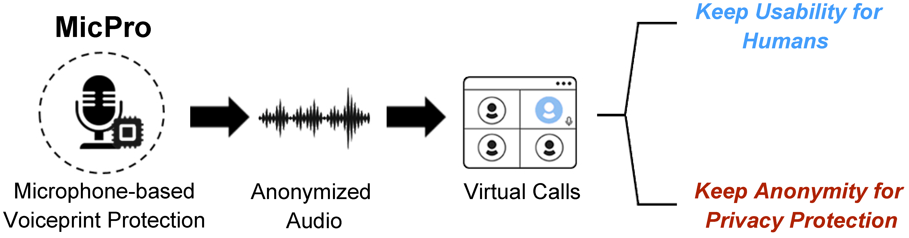
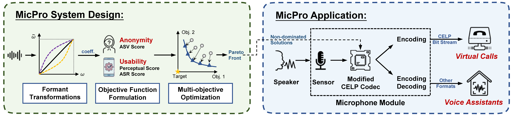
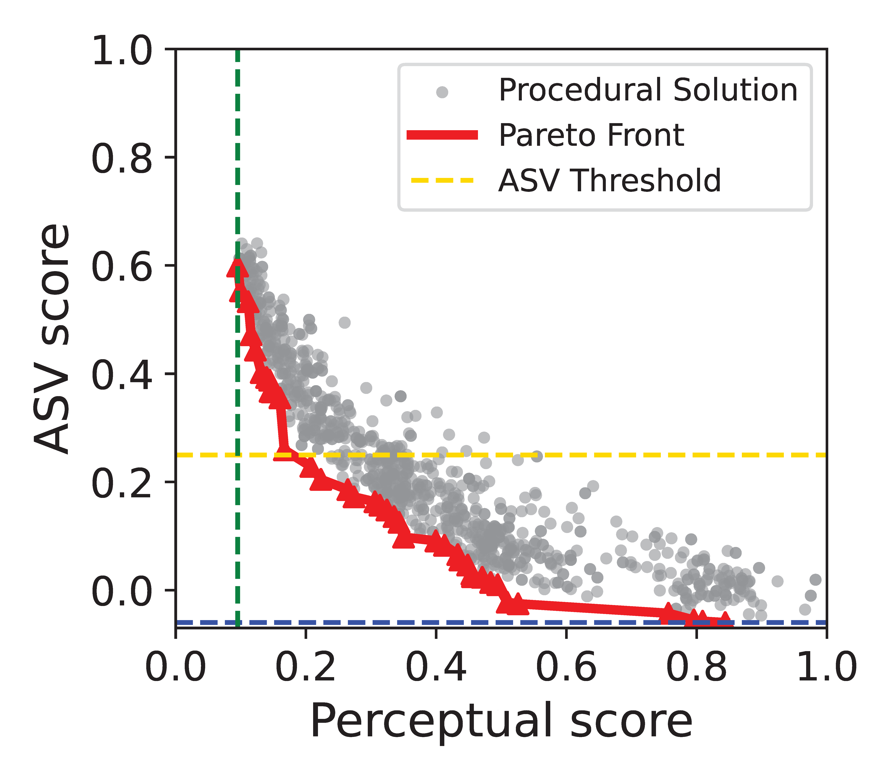
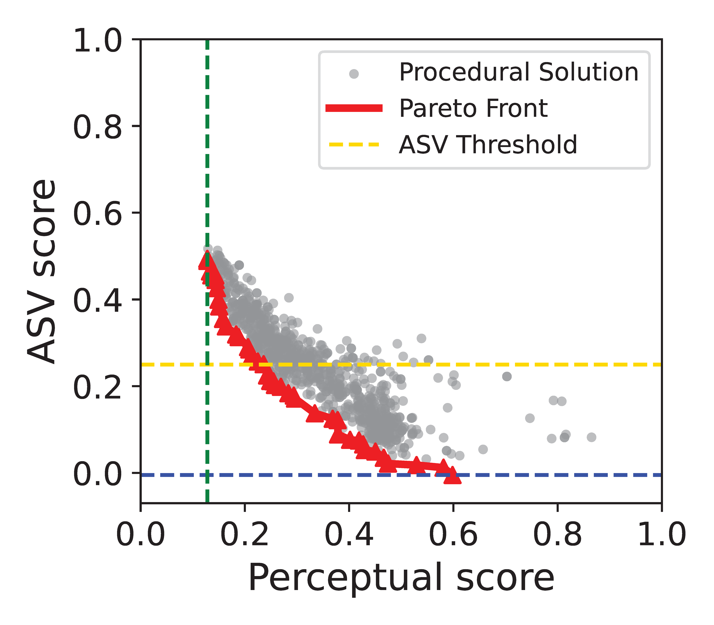
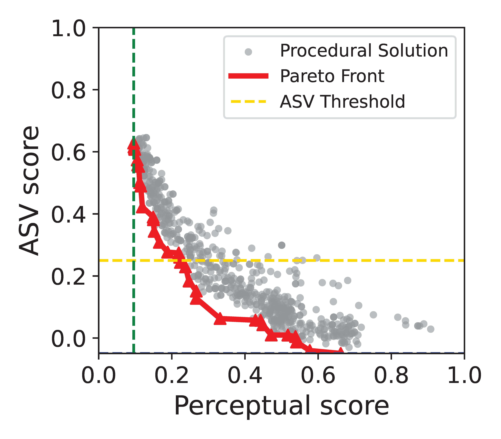
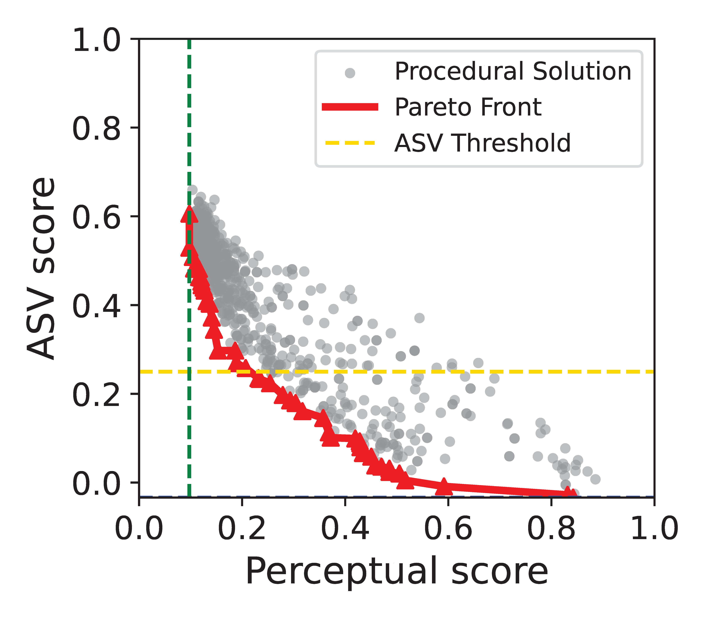

# What is MicPro?
### MicPro = Microphone + Protector

We aim to achieve voiceprint privacy protection with microphone module. Specifically, we use a modified CELP codec to transform the audio.
### Brief Introduction
MicPro is the first privacy-enhanced microphone module that can produce anonymous audio recordings with bio-metric information suppressed while preserving speech quality for human perception or linguistic content for speech recognition. Limited by the hardware capabilities of microphone modules, previous works that modify recording at the software level are inapplicable. To achieve anonymity in this scenario, MicPro transforms formants, which are distinct for each person due to the unique physiological structure of the vocal organs, and formant transformations are done by modifying the linear spectrum frequencies (LSFs) provided by a popular codec (i.e., CELP) in low-latency communications. 

To strike a balance between anonymity and usability, we use a multi-objective genetic algorithm (NSGA-II) to optimize the transformation coefficients. We implement MicPro on an off-the-shelf microphone module and evaluate the performance of MicPro on several ASV systems, ASR systems, corpora, and in real-world setup.Our experiments show that for the state-of-the-art ASV systems,MicPro outperforms existing software-based strategies that utilize signal processing (SP) techniques, achieving an EER that is 5∼10% higher and MMR that is 20% higher than existing works while maintaining a comparable level of usability.

# How does MicPro work?
## Overview

+ We first define the formant transformations to modify the formant features of the original audio frames. These transformations are parameterized using three coefficients that govern the form of the transformation.
+ We formulate a multi-objective optimization problem in terms of different defense tasks. We use the ASV score to indicate anonymity, and perceptual score and ASR score to indicate usability.
+ We adopt a multi-objective optimization algorithm based on Genetic Algorithm
(GA) to solve this problem. We get the Pareto Front as the optimal coefficients.
+ We implement these optimal coefficients into a modified CELP codec with a microphone module. The codec applies formant transformations to the original audio frames with pre-trained coefficients.

## Optimization Results
In our work, we tried several commonly-used algorithms and compared their performance, and hereby we show their performance.

+ MOGA (Multi-objective Genetic Algorithm)
+ MOEAD (Multi-objective Evolutionary Algorithm based on Decomposition)
  
  

+ MOPSO (Multi-objective Particle Swarm Optimization)
+ MOBO (Multi-objective Bayes Optimization)

 

# Code
You can find our code implementation at [README](code/README.md).

# Demo
We show how to record and anonymize audio with our MicPro microphone (Respeaker Core V2) [here](https://youtu.be/qKLYvuvBUPg).
We also provide the examples of original audio and anonymized audio (MicPro, McAdam, and Voicemask) [here](demo\audio).

# Paper
You can find our paper [here](MicPro.pdf).

# Contact
+ Prof. Wenyuan Xu (wyxu@zju.edu.cn)
+ Prof. Xiaoyu Ji (xji@zju.edu.cn)

# Powered by
## Ubiquitous System Security Laboratory (USSLab)

## Zhejiang University
